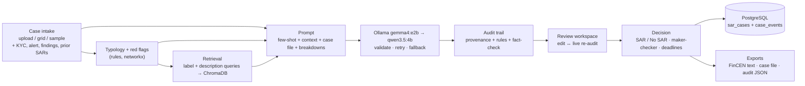

# SAR Narrative Generator with Audit Trail

A local-first RAG system that drafts **Suspicious Activity Report (SAR)** narratives from transaction data — and, more importantly, shows where every sentence came from.

Banks must file a SAR when activity suggests money laundering. Writing one takes an analyst 5–6 hours, large institutions file thousands a year, and a poorly written narrative is itself a regulatory finding. Plenty of tools can draft text with an LLM. The hard part is that a regulator will not accept "the model said so" — the narrative has to be traceable to the underlying facts, and any figure the model invents has to be caught before it reaches a filing.

So this project treats the audit trail as the product, not a log file. Nothing leaves the machine: Ollama, ChromaDB, PostgreSQL and Streamlit all run locally.

---

## What it does

An analyst brings a case — a transaction export, the customer's KYC profile, the alert that triggered the review, their investigation findings and any prior SARs — or starts from a labelled sample out of the IBM AML dataset. Then:

1. **Deterministic rules run first.** A graph of the money flow is classified into a laundering typology (fan-out, cycle, gather-scatter, …) and scanned for 12 red flags — structuring, rapid pass-through, cross-border wires, FATF-listed jurisdictions, activity far above the customer's expected volume. Every finding carries its own evidence, and the analyst can override the typology.
2. **Retrieval grounds the draft.** FinCEN advisories, FATF typology reports and the FFIEC examination manual are chunked into ChromaDB and queried by both the detected pattern and a description of the activity.
3. **A local model writes the draft** in FFIEC format (who / what / when / where / why suspicious / how), with three hand-written gold-standard narratives as few-shot examples.
4. **Every sentence is audited.** Which transaction fields it used, which retrieved passages it drew on, which rule finding it reflects — and a fact-check that flags **any amount, date, account or count that is not in the case data**, with the closest real value as a hint.
5. **The analyst decides.** Edit the draft (the audit rebuilds live, tracking what was changed, added or removed), record SAR or No SAR with a rationale, respect the 30-day filing deadline, and get a second person to approve it. Export the FinCEN narrative text, a printable case file, or the audit trail as JSON.

### Why the fact-check earns its place

On the first live run of a custom case, the model wrote **"$88,150.00"** where the data said $68,150.00, and **"nine cash deposits"** where there were seven. Both were caught and marked unverified. Adding exact count breakdowns to the prompt took that case from 4 unverified figures to 0, and from 4 fully grounded sentences to 10.

The same check, run over drafts written months earlier, found a claim of "17 separate senders" where the data has 16.

---

## How it fits together



| Module | Responsibility |
|---|---|
| `src/case_input.py` | The `CaseInput` model; importers for IBM / canonical / generic export / statement files; column-mapping synonyms |
| `src/typology.py` | Graph typology rules, red-flag rules, FATF lists, the no-SAR rule |
| `src/generate_narrative.py` | Case formatting, hybrid retrieval, the prompt, generation with validation and retry |
| `src/audit_trail.py` | Sentence provenance, the fact-check index, rule attribution, grounding status, rebuild after edits |
| `src/intake.py` | The four-step case intake screen and the funds-flow graph |
| `src/app.py` | Sidebar, generation queue, review workspace, decision and export |
| `src/review_components.py` | The draft editor and audit panes (custom Streamlit components) |
| `src/export.py` | FinCEN plain-text narrative, case file HTML/Markdown, filing deadlines |
| `src/db.py` | `sar_cases` and `case_events` in PostgreSQL |

Full detail in [docs/ARCHITECTURE.md](docs/ARCHITECTURE.md).

---

## Results

| Measure | Result |
|---|---|
| FFIEC structural completeness | 13/13 evaluation cases carry all 8 sections |
| Sentence grounding | 41 of 171 sentences fully grounded, up from 14 under the pre-intake prompt (same audit code) |
| Typology detection without the dataset label | **98.1%** (253/258) on attempts with ≥3 account links; 81.1% across all 370, where 112 attempts have ≤2 links and are inherently ambiguous |
| Negative controls | 0 of 41 RANDOM attempts raise a high-severity red flag, so "no SAR" is reached without peeking at labels |
| Retrieval | 14/16 label queries, 12/16 description queries — hybrid retrieval covers the gap |
| Fact-check | Caught 3 invented figures in live runs; on the 13-case re-run it flagged 17 more, 15 of which are real amounts written with a `$` in front of a non-dollar currency |
| Tests | 44 pytest tests |
| Generation | 29–37s per narrative on a local 5B model |

Method and caveats: [docs/EVALUATION.md](docs/EVALUATION.md). The honest limitations are collected in [docs/INTERVIEW_PREP.md](docs/INTERVIEW_PREP.md) §6 — including the fact that the typology rules were designed against the same IBM data they are scored on.

---

## Quick start

**Prerequisites:** Python 3.11+ (developed on 3.14), [Ollama](https://ollama.com), and Docker for PostgreSQL.

```bash
python -m venv .venv && .venv/bin/pip install -r requirements.txt
```

```bash
ollama pull gemma4:e2b && ollama pull qwen3.5:4b
```

Download the seven regulatory PDFs listed in [sources/SOURCES.md](sources/SOURCES.md) into `sources/` — they are third-party publications, so the repository links to the publishers rather than redistributing them. Then build the knowledge base (~843 chunks into `chroma_db/`):

```bash
.venv/bin/python src/embed_typology_docs.py
```

Start PostgreSQL:

```bash
docker compose up -d
```

Run the app:

```bash
.venv/bin/streamlit run src/app.py
```

Or run it in a container instead, alongside PostgreSQL (Ollama stays on the host and keeps the GPU):

```bash
docker compose --profile app up -d --build
```

Choose **New case** in the sidebar and upload a transaction file — `tests/fixtures/generic_structuring.csv` is a worked example, with its KYC profile and investigation notes in `generic_structuring_case.json`. Without PostgreSQL the app still drafts and audits; you just cannot save or reload cases.

### Optional: the IBM dataset samples

The **Samples** mode draws on the IBM AML dataset, which is not in this repository (the transaction file is 454 MB). Download the HI-Small variant of [IBM Transactions for Anti Money Laundering](https://www.kaggle.com/datasets/ealtman2019/ibm-transactions-for-anti-money-laundering-aml) from Kaggle, put `HI-Small_Trans.csv`, `HI-Small_Patterns.txt` and `HI-Small_accounts.csv` in the repository root, then build the working set:

```bash
.venv/bin/python src/data_loader.py
```

That produces `data/laundering_transactions.parquet` — 3,209 laundering transactions across 370 attempts, enriched with bank and entity names.

### Reproducing the evaluation

```bash
.venv/bin/python src/evaluate_typology.py
```

```bash
.venv/bin/python src/evaluate_narratives.py
```

The second command regenerates all 13 drafts in `generated/` with the local model.

```bash
.venv/bin/python src/build_audit_trails.py --store-db
```

Rebuilds the audit trails for the drafts already in `generated/` and loads them into PostgreSQL, without calling the model. It replays the same case, rules and retrieval the generator used and carries the original timings and model settings over from the record it replaces, so a rebuilt record reproduces the generated one rather than a thinner version of it.

### Tests

```bash
.venv/bin/python -m pytest
```

---

## Repository layout

```
src/          pipeline and app (see the module table above)
tests/        44 pytest tests + fixtures for every upload format
narratives/   16 hand-written gold-standard SAR narratives (the benchmark)
generated/    model drafts for the 13 evaluation cases
sources/      regulatory PDFs: FinCEN, FATF, FFIEC, APG, GARG-AML
docs/         architecture, evaluation, data dictionary, roadmap, decision log
```

The gold-standard narratives in `narratives/` are hand-written, deliberately. An AI-generated "gold standard" would make the benchmark circular.

---

## Scope

**Not in scope:** submission to BSA E-Filing, real authentication or SSO, multi-platform case management integration, streaming ingestion, cloud deployment. This is a portfolio project demonstrating the provenance problem, not a filing system.

**Data:** the transaction data is synthetic (IBM's AML dataset). Real SAR narratives are not public — they are evidence in financial crime cases — so the gold standards are hand-written against synthetic transactions using public regulatory guidance as the structural reference. The FATF jurisdiction lists are a snapshot from the June 2026 plenary and are dated as such in the code.
